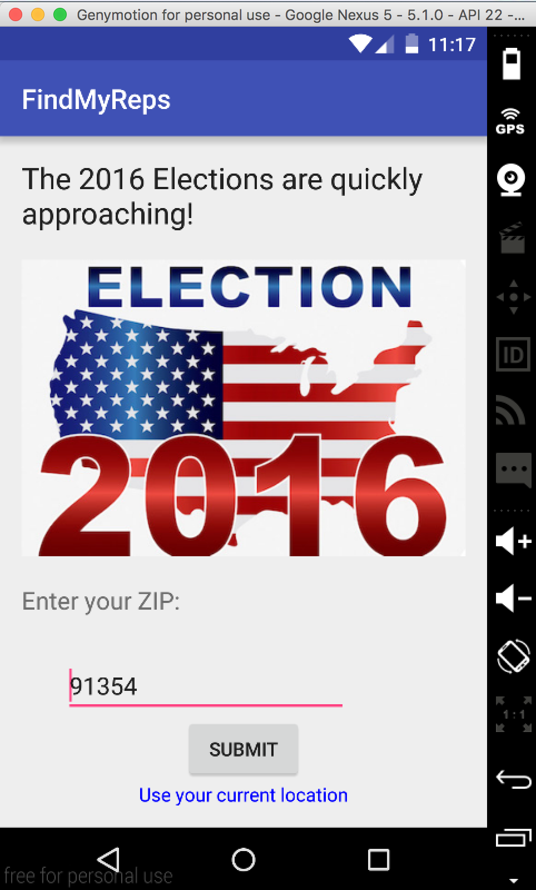
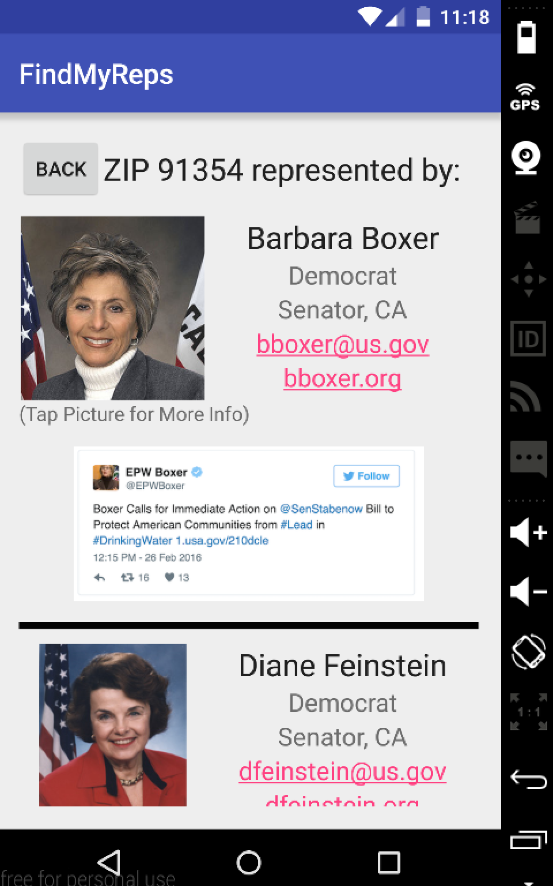
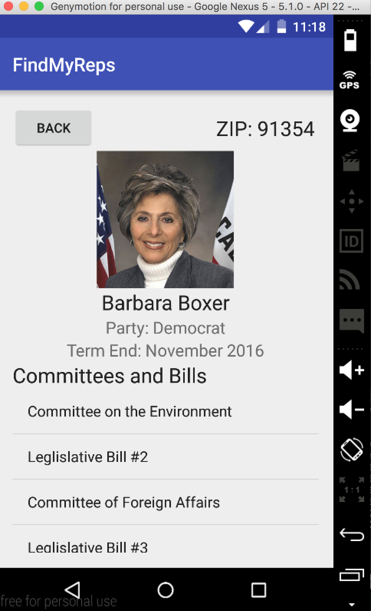
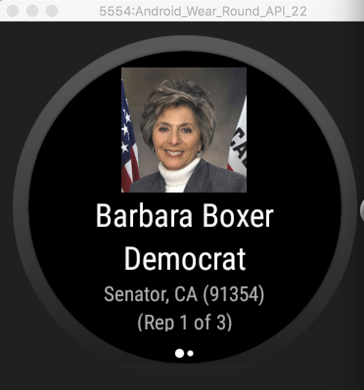
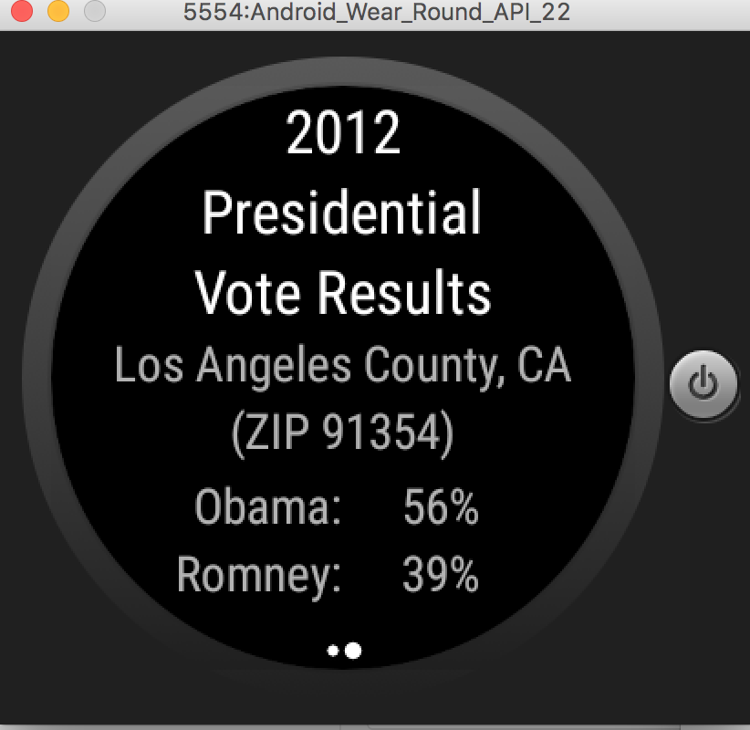

# PROG 02: Represent!

####Application Name:####

Find My Reps!

####Description:####

This application allows a user to input a ZIP code (or use their current location) and find detailed information about the Congressional representatives for that area. There is also a Android Watch interface to swipe through representatives, or use a "shake" gesture to select a random location. The next part of the project will use APIs to utilize real congressinonal data.

## Authors

Ryan Casey ([rcasey@berkeley.edu](mailto:rcasey@berkeley.edu))

## Demo Video

See [PROG 02-B: Find My Reps!] (https://youtu.be/rUb_mjl1Tpg)

## Screenshots

## Acknowledgments

* CS 160 course staff for starter code
* Android docs 
