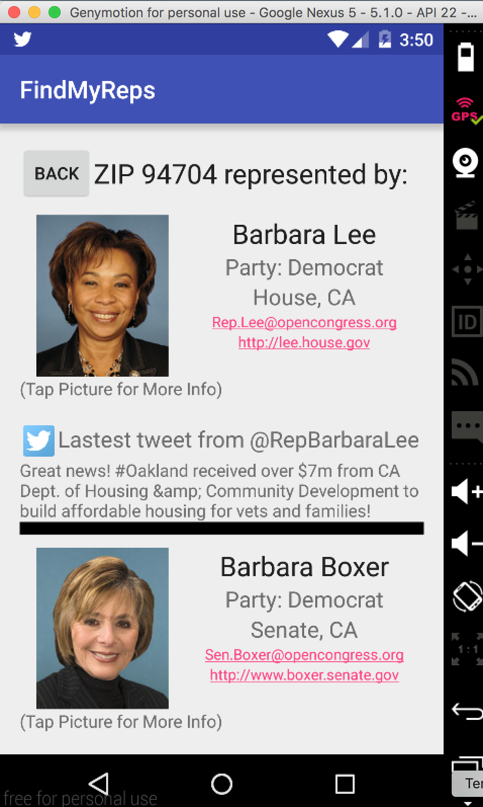

# PROG 02: Represent!

####Application Name:####

Find My Reps!

####Description:####

This mobile/wear Android application allows a user to find information on congressional representatives of a certain ZIP code. This is especially pertinent in early 2016, as there are many elections coming up in 2016 (presidential, state, and local) and this application can help users find information that might be relevant in deciding which candidates to support.

This application allows a user to input a ZIP code (or use their current location) and find detailed information about the Congressional representatives for that area. There is also a Android Watch interface to swipe through representatives, or use a "shake" gesture to select a random location. We use Sunlight, Google, and Twitter APIs to populate the interface with real congressional data.

## Authors

Ryan Casey ([rcasey@berkeley.edu](mailto:rcasey@berkeley.edu))

## Demo Video

See [PROG 02-C: Find My Reps!] (https://youtu.be/DpBhcAPYCuk)

## Screenshots

Mobile:

Watch:

## APK Files
Please find the apk files in the Apk/ folder

## Acknowledgments

* CS 160 course staff for starter code
* Android docs 
